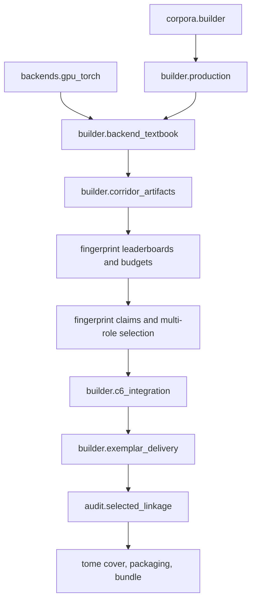

# RADJAX-Tome M1 Hydra Inventory and Dependency Map

Status: **canonical M1 reconnaissance report**
Repository examined: `nova-rey/RADJAX-Tome`
Baseline: `7a56a0808453f4b4ecc6cefe3ee63b724c701980`
Examined: 2026-07-12

## 1. Finding

The repository contains a working product spine, but that spine is embedded in a research-shaped public surface.

The software has:

- 98 Python source files;
- 60 test modules;
- 23 top-level CLI commands/subcommands before nested corpus/model actions are counted;
- 16 standalone Python scripts;
- 36 top-level documentation files;
- overlapping toy, fake, CPU-reference, generic HF, GPU, one-pass, two-pass, global-only, corridor-first, legacy TeacherTextbook, fingerprint-research, and packaging routes.

The supported native path is enabled only when all four conditions below are true:

```python
selection_integration_policy == "corridor_first_global_backfill_v1"
target_policy == "corridor_exemplar_v1"
exemplar_selection_enabled is True
exemplar_delivery_path == "two_pass_rerun_selected"
```

That is the secret handshake. It is implementation knowledge masquerading as user configuration.

The main production configuration currently exposes roughly 60 flat fields. `builder/production.py` is about 3,300 lines, `builder/exemplar_delivery.py` about 3,400 lines, and `backends/gpu_torch.py` about 2,500 lines. The canonical path is therefore real but not yet represented as a clean product architecture.

## 2. Canonical dependency spine



Cross-cutting supporting layers are `targets.schema/store`, `provenance`, `io`, `quantization`, `reports.runtime_doctor`, `reports.run_plan`, and parity utilities.

## 3. Stage and artifact ownership

| Canonical stage | Current owner(s) | Principal outputs | Refactor observation |
|---|---|---|---|
| Corpus | `corpora/builder.py` | `corpus.jsonl`, manifest, build report | Deterministic but list/materialization based |
| Preflight/plan | `reports/runtime_doctor.py`, `reports/run_plan.py`, `builder/production.py` | doctor and run-plan reports | Accelerator checks leak into finalization resume |
| Score pass | `builder/backend_textbook.py`, `backends/gpu_torch.py` | target shards, run manifest, score evidence | Canonical emission engine shares schemas with legacy builders |
| Fingerprint-corridor export | `builder/corridor_artifacts.py` | packed assignments, modes, candidate features | Domain is one concept despite split naming |
| Boards and allocation | `fingerprint/corridor_leaderboards.py`, `corridor_budget.py` | per-mode boards, coverage plan | Sound C2/C3 logic exposed as standalone product commands |
| Claim/dedupe/backfill | `fingerprint/corridor_claims.py` | claims, collisions, backfill lineage | Canonical C4 authority |
| Frozen selection/passports | `fingerprint/multi_role_selection.py`, `builder/c6_integration.py` | obligations, routes, passports, authority manifest | Also emits a legacy flat projection |
| Selected rerun/delivery | `builder/exemplar_delivery.py`, `backends/gpu_torch.py` | transactional selected payloads and index | Correct, large, slow, one payload file per coordinate |
| Validation/audit | `builder/teacher_textbook.py`, `builder/exemplar_delivery.py`, `audit/selected_linkage.py`, `builder/c6_integration.py` | validation, delivery, linkage, reconciliation reports | Multiple validators; finalization memory peak is too high |
| Cover/package | `tome/cover_page.py`, `tome/packaging.py`, `tome/bundle.py` | cover page, debug/student packages | Packaging imports selection internals and audit logic |
| Orchestration | `builder/production.py`, `cli/main.py` | lifecycle/progress/production report | Too many responsibilities and configuration flags |

## 4. Source disposition

The following is the M1 disposition. “Keep” means keep the behavior/API contract, not necessarily the current filename.

### 4.1 Canonical

| Surface | Disposition | Reason |
|---|---|---|
| `corpora/builder.py` | Canonical, rewrite internally | Owns validated corpus artifact and provenance |
| `backends/base.py` | Canonical interface, narrow it | Teacher emission and batch policy contract |
| `backends/gpu_torch.py` | Canonical GPU implementation, split it | Proven T4 score pass and selected rerun |
| `backends/hf_causal_lm.py` | Canonical loader helper | Local Hugging Face model loading |
| `builder/backend_textbook.py` | Canonical score-pass engine | Streaming sharded teacher pass |
| `builder/corridor_artifacts.py` | Canonical fingerprint-corridor authority | Builds packed assignments, modes, and observations |
| `fingerprint/corridor_archetypes.py` | Canonical | Candidate qualification/scoring |
| `fingerprint/corridor_leaderboards.py` | Canonical | Per-mode ranked supply |
| `fingerprint/corridor_budget.py` | Canonical | Coverage allocation |
| `fingerprint/corridor_claims.py` | Canonical | Claim, dedupe, collision, and backfill authority |
| `fingerprint/multi_role_selection.py` | Canonical core with compatibility projection split out | Frozen role obligations and passports |
| `builder/c6_integration.py` | Canonical behavior, rename/split | Connects score authority to integrated selection |
| `builder/exemplar_delivery.py` | Canonical behavior, major split | Selected-position rerun and transactional delivery |
| `audit/selected_linkage.py` | Canonical | Strict passport/source/payload linkage proof |
| `builder/long_tail.py` | Canonical policy helper | Selected-payload diagnostics |
| `builder/cascaded_soft_labels.py` | Canonical payload encoding | Cascading bucket semantics |
| `tome/cover_page.py` | Canonical | Artifact truth surface |
| `tome/packaging.py` | Canonical behavior, decouple internals | Debug/student package construction |
| `tome/bundle.py` | Canonical | Transport bundle operations |
| `builder/production.py` | Canonical façade, replace internals | Current working orchestrator |

### 4.2 Supporting

| Surface | Disposition | Reason |
|---|---|---|
| `targets/schema.py`, `targets/store.py` | Supporting contract | Score-pass storage and metadata |
| `targets/consumption.py`, `targets/multishard.py` | Supporting | Bounded shard consumption |
| `io/*` | Supporting | JSON/JSONL/array I/O; add atomic/streaming primitives |
| `provenance/*` | Supporting | Model and artifact identity |
| `quantization.py` | Supporting | Quantization-aware entropy parity |
| `reports/runtime_doctor.py` | Supporting | Preflight capability evidence |
| `reports/run_plan.py` | Supporting | Cost/batch planning |
| `reports/parity.py` | Supporting | Golden and artifact parity |
| `reports/metadata_sanity.py` | Supporting | Truthfulness checks |
| `backends/registry.py` | Supporting, reduce public emphasis | Backend construction |
| `backends/orchestration.py` | Supporting/review | Batch orchestration may serve M8 |
| `corpora/tokenizer.py` | Supporting | Token-count chunking and previews in M10 |
| `corpora/loaders.py` | Fold into corpus streaming API | Duplicate JSONL loading route |
| `tome/golden_fixture.py` | Promote | Natural home for M2 contract fixture |

### 4.3 Research-frozen

| Surface | Preserve because | Mainline policy |
|---|---|---|
| `builder/multi_gpu_path_b.py` and `docs/MULTI_GPU_PATH_B.md` | Experimental map/reduce scheduling work | Archive until single-GPU stage API is stable |
| `backends/hf_specimen.py`, `hf_export.py`, `qwen_policy.py` | Model-swap and policy experiments | Research namespace/branch |
| `fingerprint/artifacts.py`, `capture_summary.py`, `corridor.py`, `generation.py`, `inspection.py`, `loader.py`, `measurement.py`, `real_teacher_artifacts.py`, `summary.py`, `validation.py` | Earlier generalized fingerprint artifact research | Preserve; canonical code should use only demonstrated portions or migrate them deliberately |
| `reports/arc.py`, `baseline.py`, `fingerprint_quality.py` | Research evaluation reports | Archive or research extra |
| `capabilities/proof.py` | Historical capability-matrix proof | CI/research tool, not user product flow |
| `corpora/prompts.py`, `splitters.py`, `tokenization.py` | Older prompt/split/tokenized-corpus pipeline | Preserve pending M10 requirements review |

### 4.4 Compatibility-only

| Surface | Compatibility responsibility | Removal condition |
|---|---|---|
| `builder/teacher_textbook.py` | Legacy TeacherTextbook build/validation and old sidecars | Canonical reader/validator and archived fixture coverage replace it |
| `targets/compression.py`, `targets/export.py`, `targets/inspection.py` | Legacy target-store utilities | No canonical imports and archive parity passes |
| `backends/cpu.py` | Reference/parity and fixture backend | Keep only the minimal reference implementation required by tests |
| `backends/hf_torch.py` | Generic non-accelerator/reference HF route | GPU backend no longer imports its private helper |
| `backends/fake.py`, `synthetic.py` | Deterministic tests and fixtures | Keep under testing/support namespace, not production help |
| `builder/production.py` compatibility migration block | Upgrades C6.3.5-era metadata without payload body writes | Supported artifact migration window closes |
| `fingerprint/multi_role_selection.py` legacy flat projection | Old selected-exemplar consumers | All supported readers use rich records and payload index |
| `emit/teacher_tome.py` | Toy Contract compatibility | Move to examples/tests or archive |

### 4.5 Remove-after-parity or convert to thin aliases

- `cli/build_teacher_tome.py` and the duplicate five-line `scripts/build_teacher_tome.py`;
- standalone wrappers for build, validate, inspect, tokenize, split, capability proof, and parity when the same operation exists in the main CLI;
- top-level public C2–C5 assembly commands after they move under `radjax-tome research`;
- top-level `multi-gpu-path-b` until it graduates through a new product proposal;
- duplicate builder/config/validation/records fossils that are not imported by canonical code after M6;
- chronological roadmap assertions that present completed experiments as current user architecture.

No item is deleted until M2 parity and M3 archive pointers exist.

## 5. CLI inventory and disposition

| Current command | Status | Product action |
|---|---|---|
| `production-build` | Canonical engine | Replace with or alias to opinionated `run`; retain advanced config file |
| `plan` | Supporting | Fold into `run --dry-run` and keep expert form |
| `doctor` | Supporting | Keep; make stage-aware |
| `validate` | Canonical | Keep as artifact validation entry point |
| `audit-selected-linkage` | Canonical expert operation | Invoke automatically; keep explicit audit command |
| `package-artifact`, `validate-package`, `pack`, `unpack` | Canonical/supporting | Consolidate under `package`/`bundle` groups |
| `corpus build/inspect/validate` | Canonical | Overhaul and retain |
| `model inspect/validate/discover` | Supporting | Retain under `model` |
| `build` | Compatibility/toy | Rename `research legacy-build` or remove after parity |
| `inspect` | Ambiguous compatibility | Replace with typed `status`/`inspect` groups |
| `parity`, `exemplar-delivery-parity` | Engineering support | Move under `dev` or `research` |
| `build-fingerprint-corridor-leaderboards` | Research/expert stage | Hide under `research`; production calls it internally |
| `allocate-fingerprint-corridor-coverage` | Research/expert stage | Hide under `research` |
| `claim-corridor-and-backfill-global` | Research/expert stage | Hide under `research` |
| `export-production-global-board-supply` | Research/expert stage | Hide under `research` |
| `build-multi-role-selected-exemplars` | Research/expert stage | Hide under `research` |
| `multi-gpu-path-b` | Research-frozen | Archive from mainline CLI |
| `prove-capabilities` | CI/research | Remove from user happy path |

The current README recommends the fake `build` route. That is the largest documentation/product mismatch and should be corrected as soon as the golden fixture lands.

## 6. Documentation disposition

### Rewrite as canonical user documentation

- `README.md`;
- `docs/ARCHITECTURE.md` (currently nearly empty);
- `docs/CLI_GUIDE.md`;
- `docs/PRODUCTION_BUILD.md`;
- `docs/CORPUS_BUILDER.md`;
- `docs/TOME_ARTIFACTS.md`;
- `docs/TOME_COVER_PAGE.md`;
- `docs/TOME_BUNDLE.md`;
- `docs/GPU_INSTALL.md` and `docs/GPU_RUN_PLANNER.md` with T4 wording.

### Convert to internal design references

- `docs/C6_INTEGRATION.md`;
- `docs/CORRIDOR_ARCHETYPES_C1.md`;
- `docs/CORRIDOR_LEADERBOARDS_C2.md`;
- `docs/CORRIDOR_BUDGET_C3.md`;
- `docs/CORRIDOR_CLAIMS_C4.md`;
- `docs/MULTI_ROLE_SELECTION_C5.md`;
- `docs/STREAMING_RESUME.md`;
- `docs/TEACHER_BACKENDS.md`;
- `docs/TEACHER_MODEL_PROVENANCE.md`.

These can remain searchable, but user docs should describe domain stages rather than C-number implementation history.

### Archive/research index

- `docs/SPEC3_ROADMAP.md`;
- `docs/BIBLE.md`;
- `docs/MULTI_GPU_PATH_B.md`;
- `docs/FINGERPRINT_API.md` where it describes generalized experiments;
- HF specimen/optional teacher material;
- migration inventories, capability matrices, A/B migration audits, and optimization handoffs.

The repository already has a successful precedent: `archive/tome-migration-audit`, `archive/tome-large-docs`, and `TOME_MAINLINE_HYGIENE_LEDGER.json`. M3 should repeat that pattern for the new consolidation rather than inventing a second archival convention.

## 7. Corpus builder diagnosis

The corpus builder has a good deterministic core:

- LF normalization and trailing-whitespace policy;
- stable canonical rows;
- exact normalized-text SHA-256 deduplication;
- deterministic character windows;
- corpus and manifest hashes;
- source accounting and validation.

Its implementation is not production-shaped:

- `_jsonl_text_rows` returns lists;
- `_build_rows` holds the complete row set;
- validation reads the complete corpus row set;
- `_corpus_jsonl_bytes` materializes the complete serialized output;
- only `.txt`, `.md`, `.markdown`, `.py`, and JSONL `text` inputs are accepted;
- JSON is unsupported;
- corpus building, prompt corpora, splitting, and tokenization are separate overlapping APIs.

M10 should preserve the deterministic policies while replacing accumulation with iterators, staged temporary files, incremental hashing, bounded dedup storage, and typed input adapters.

## 8. Test inventory

The test suite has strong component coverage, especially around:

- production build orchestration;
- C6 integration;
- corridor archetypes, leaderboards, budgets, and claims;
- multi-role selection;
- selected delivery and adversarial linkage;
- GPU reducers and backend error handling;
- cover pages and packaging;
- corpus provenance and tokenization.

The weakness is product-contract shape: many tests prove historical components independently, while the live T4 golden 1K result is not yet a compact, canonical end-to-end semantic fixture.

M2 must establish three layers:

1. stage unit contracts;
2. a CPU/fake fast integration fixture;
3. the real golden 1K semantic evidence bundle, checked without requiring a T4 on every CI run.

Test collection was not executed during this reconnaissance because the scratch runtime did not include `pytest`; this report maps test sources statically. The live T4 run supplies the runtime evidence summarized in the canonical arc.

## 9. Principal risks

| Risk | Evidence | Required control |
|---|---|---|
| Semantic drift during module moves | Selection authority spans several modules and schemas | Golden coordinate/passport/payload contract before refactor |
| Compatibility code infects new writer | Production currently performs in-place metadata migration | Separate migration command/pre-stage and canonical schema version |
| Validation fails to scale | Golden finalization peaked around 10 GB host memory | Streaming iterators and memory gates in M7 |
| Selected pass underutilizes GPU | 214 examples took about 269 seconds in 27 nominal batches | M8 profiling and vectorized selected-position gather |
| CLI remains a flag assembly language | Four-condition gate plus roughly 60 config fields | Presets and stage-aware configuration in M5/M9 |
| Research history disappears | Large amount of real experiment work | Tag, archive branch, disposition ledger, pointers before removal |
| Research code remains accidental API | C2–C5 and multi-GPU are top-level commands | Explicit `research` namespace and public API allowlist |
| Terminology causes conceptual errors | Separate fingerprint/corridor surfaces and old docs | Canonical “fingerprint corridor” glossary and schema naming policy |

## 10. M1 deliverables for the repository

Codex should add, without changing runtime behavior:

1. `docs/MAINLINE_CONSOLIDATION_ARC.md` from the canonical arc;
2. `docs/HYDRA_INVENTORY.md` from this report;
3. `docs/RESEARCH_STATUS.md` with status, preservation pointer, and replacement for every research surface;
4. `docs/hydra_disposition.json` with one record per module, CLI command, script, and doc;
5. an architecture decision record declaring native fingerprint-corridor Path B the mainline;
6. a CI test that ensures all public commands and source modules appear in the disposition ledger;
7. no code deletion and no behavioral refactor in M1.

## 11. M1 acceptance criteria

- The inventory is exhaustive against the checked-out tree.
- Every disposition has an owner milestone and archive/removal condition.
- The canonical dependency graph contains no research-frozen runtime import.
- The product contract says “fingerprint corridor” consistently.
- The golden 1K lock is reproduced verbatim in the repo docs.
- Existing tests are unchanged except for additive ledger/document checks.
- `git diff` contains documentation, ledger, and ledger tests only.

## 12. Immediate recommendation

Do not launch the 100K production run yet. First land M1, freeze M2, and preserve M3. Then refactor the stage state machine and streaming finalization before paying to discover the already-known 10 GB validation shape at 100× the score-pass volume.

## 13. Known Baseline Dependency-Boundary Violations

The canonical dependency spine above is the target product graph, not a claim
that the checked-out package initializers are already clean. M1 inspection
found these current runtime import boundaries:

| Initializer | Research-frozen imports reached by package initialization | Remediation |
|---|---|---|
| `backends/__init__.py` | `hf_specimen`, `hf_export`, `qwen_policy` | M6 narrow package exports |
| `builder/__init__.py` | `multi_gpu_path_b` | M3 preservation, then M6 package boundary split |
| `reports/__init__.py` | `arc`, `baseline`, `fingerprint_quality` | M6 narrow package exports |

These are known baseline dependency-boundary violations. They are recorded in
`hydra_disposition.json` and deliberately receive no runtime import edits in
M1. The clean graph remains a future-state M3/M6 exit criterion.
