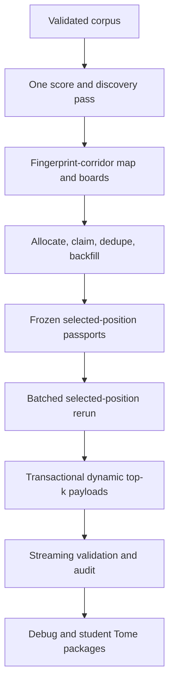

# RADJAX-Tome Mainline Consolidation and Productization Arc

Status: **canonical**
Canonicalized: 2026-07-12
Repository baseline: `7a56a0808453f4b4ecc6cefe3ee63b724c701980`
Companion inventory: `RADJAX_TOME_M1_HYDRA_INVENTORY_AND_DEPENDENCY_MAP.md`

## 1. Decision

RADJAX-Tome will stop treating every historical experiment as an equally supported product path. The native, two-pass, fingerprint-corridor Path B pipeline proven by the T4 golden 1K run is the product mainline.

The repository will preserve research history, but product engineering will concentrate on one route:



“Fingerprint corridor” is one domain concept. Documentation, CLI language, schemas, and module boundaries must not imply that fingerprints and corridors are separable product stages.

## 2. Product contract

The mainline does the following:

1. Validate and fingerprint a deterministic corpus artifact.
2. Run the teacher once across the chosen corpus window to emit compact score-pass evidence and discover fingerprint corridors.
3. Build per-fingerprint-corridor candidate leaderboards and the global candidate supply from that same pass.
4. Allocate a bounded corridor budget, claim corridor exemplars, deduplicate coordinates, and backfill from the global boards.
5. Freeze the unique selected-position obligations and their source passports.
6. Rerun only the selected source examples, in batches, and materialize only the selected positions as dynamic-top-k, cascading-bucket-compressed payloads.
7. Write payloads transactionally with a complete payload index and authority hashes.
8. Validate the artifact, audit source/passport/payload linkage, reconcile the integrated selection contract, write the cover page, and package the Tome.

The score pass discovers and ranks. The selected pass materializes expensive student-facing payloads. Selection authority never comes from the rerun.

## 3. Golden 1K behavioral lock

Refactoring must preserve the verified T4 result unless an intentional contract change is separately proposed and approved.

| Property | Golden value |
|---|---:|
| Model | Gemma 3 270M |
| Vocabulary | 262,144 |
| Corpus examples examined | 1,000 |
| Sequence length | 128 |
| Fingerprint-corridor modes | 47 |
| Assigned token positions | 34,220 |
| Corridor claims | 128 |
| Global claims | 128 |
| Final unique selected coordinates | 256 |
| Cross-role overlaps observed before final uniqueness | 2 |
| Corridor/global Jaccard | approximately 0.001776 |
| Unique source examples rerun | 214 |
| Selected rerun batch size | 8 |
| Selected rerun batches | 27 |
| Full teacher passes | 1 |
| Native selected teacher reruns | 1 |
| Legacy selected teacher reruns | 0 |
| Indexed payload records | 256 |
| Delivery validation | pass |
| Artifact validation | pass |
| Strict selected-linkage audit | pass |
| Final production status | pass, zero blockers, zero warnings |

Golden-lock fields include:

- selected coordinate set and stable ordering;
- role obligations and corridor/global allocation;
- deduplication and backfill outcomes;
- source passports and authority hashes;
- score-pass-to-rerun linkage;
- dynamic-top-k and cascading-bucket payload semantics;
- validation, audit, cover-page, and packaging truthfulness.

Performance improvements may alter batching, shard grouping, memory usage, progress reporting, and internal module boundaries. They may not silently alter the locked behavior.

## 4. Product and research policy

Every active surface receives one of five statuses:

| Status | Meaning | Engineering policy |
|---|---|---|
| `canonical` | Required by the supported production path | Strengthen, document, profile, and simplify |
| `supporting` | Shared infrastructure used by canonical code | Maintain behind narrow APIs |
| `research-frozen` | Valuable experiment, not a supported product path | Preserve on an archive branch; no feature work on main |
| `compatibility-only` | Needed to read, migrate, or validate existing artifacts | Isolate, test, and set a removal condition |
| `remove-after-parity` | Duplicate wrapper or dead public surface | Remove from main after archive and parity gates pass |

Research-frozen does not mean discredited. It means “not part of the product support promise.” New research begins from an explicit research branch or proposal, not by adding another peer route to the main CLI.

## 5. Refactor law

1. Preserve behavior before moving code.
2. Freeze the golden 1K fixture and reports before deleting or consolidating paths.
3. Archive first; remove second.
4. Keep compatibility readers out of canonical writers.
5. Put stage boundaries in code and artifact schemas, not only in documentation.
6. Make invalid stage transitions impossible or explicit.
7. Stream corpus processing, payload validation, and packaging.
8. Use one canonical configuration object with named presets and an advanced override layer.
9. Keep one top-level production command; move research commands under an explicitly unstable namespace.
10. Treat CPU-only finalization as a supported stage resume, not as a failed GPU build.

## 6. Milestones

### M1 — Hydra inventory and dependency map

Classify all source modules, commands, scripts, tests, docs, schemas, and artifact surfaces. Record the canonical dependency spine and every competing route. Produce a machine-readable disposition ledger.

Exit criteria:

- every active Python module, public CLI command, script, and top-level doc is classified;
- the canonical stage graph and artifact ownership are documented;
- archive candidates and compatibility removal conditions are explicit;
- no runtime behavior changes.

### M2 — Golden 1K artifact freeze and behavioral contract

Turn the successful T4 run into a durable contract fixture. Store compact manifests, selected obligations, passports, authority hashes, board summaries, payload-index metadata, validation/audit summaries, and expected stage counts. Large model payloads need not enter Git.

Exit criteria:

- one command checks golden behavioral parity;
- coordinate, role, passport, and payload-semantic drift fails CI;
- allowed nondeterminism and quantization tolerances are documented;
- the fixture distinguishes semantic hashes from storage-layout hashes.

### M3 — Research archive, tag, and preservation branch

Create a tagged pre-consolidation point and archive branch. Move research-only docs and implementation history there. Add a concise mainline research-status map with exact Git pointers.

Exit criteria:

- history is recoverable by documented tag/branch names;
- main no longer presents research paths as supported peers;
- archived code is not imported by canonical runtime code;
- the disposition ledger records the preservation pointer for every archived surface.

### M4 — Canonical pipeline state machine

Represent the production lifecycle as explicit stages with resumable checkpoints:

`preflight → score_pass → fingerprint_corridor_authority → integrated_selection → selected_delivery → validation → linkage_audit → reconciliation → cover_page → packaging → complete`

Exit criteria:

- each stage has declared inputs, outputs, hashes, and completion criteria;
- resume selects the earliest incomplete or invalid stage;
- CPU-only finalization bypasses accelerator preflight when no teacher work is needed;
- reports cannot say `running` after a terminal failure;
- compatibility migration is a bounded pre-stage, not interleaved product logic.

### M5 — Mainline configuration and schema consolidation

Replace the roughly 60-field flat production configuration with nested, typed stage configuration plus named presets.

Required preset families:

- `smoke`;
- `t4-1k`;
- `t4-10k`;
- `production-100k`;
- explicit `advanced` overrides.

Exit criteria:

- the canonical path does not require users to know the four-condition native C6 gate;
- incompatible options fail before model loading;
- resolved configuration is written once and hashed;
- defaults do not retain unselected payloads;
- terminology consistently says fingerprint corridor.

### M6 — Production module-boundary refactor

Split the 3,300-line production orchestrator and 3,400-line delivery module by stage and responsibility. Keep a thin application service that wires stable interfaces.

Target boundaries:

- `pipeline/preflight.py`;
- `pipeline/score_pass.py`;
- `pipeline/fingerprint_corridors.py`;
- `pipeline/selection.py`;
- `pipeline/selected_delivery.py`;
- `pipeline/finalization.py`;
- `pipeline/state.py`;
- `pipeline/config.py`.

Exit criteria:

- no stage reaches into another stage's private files;
- stage reports have one owner;
- legacy Path A selection/delivery is outside canonical modules;
- golden 1K parity remains exact.

### M7 — Payload sharding and streaming validation

Replace one-file-per-coordinate payload output and memory-heavy final validation with bounded shards and iterators.

Exit criteria:

- configurable payload records or bytes per shard;
- payload index addresses `(shard, row)` and binds payload hashes;
- validators and auditors stream and use bounded memory;
- packaging does not load the entire selected payload set;
- validation peak memory is measured and materially below the approximately 10 GB golden-run peak.

### M8 — Selected-pass performance and batching

Optimize the actual selected-position teacher pass. The current batching is functionally correct but underutilizes the T4 and pays avoidable per-batch work.

Work includes:

- length-aware selected-example batching;
- one model load per selected pass;
- batched tokenization and forward calls;
- vectorized gather of multiple selected positions per source example;
- adaptive OOM retry and batch-size telemetry;
- overlap of CPU serialization with GPU execution where safe.

Exit criteria:

- no semantic change to selected payloads;
- golden 1K reruns exactly 214 examples and fulfills 256 coordinates;
- throughput and utilization improve against the recorded baseline;
- peak host/device memory stays bounded and reported.

### M9 — Opinionated mainline CLI

Introduce a simple supported interface. A representative shape is:

```text
radjax-tome corpus build ...
radjax-tome run --preset t4-1k --model ... --corpus ... --output ...
radjax-tome status --artifact ...
radjax-tome validate --artifact ...
radjax-tome package --artifact ... --profile student
radjax-tome research ...
```

Exit criteria:

- one production command selects the canonical pipeline automatically;
- `--dry-run` shows resolved stages, costs, and configuration;
- `status` explains resumability and the next action;
- advanced C2–C6 commands are hidden under `research` or removed from main;
- help text contains a complete T4 example without secret flags.

### M10 — Corpus builder overhaul

Keep deterministic normalization, exact deduplication, provenance, and hashes. Replace the list/materialization architecture with a streaming ingest pipeline.

Required capabilities:

- streaming JSONL and text-family input;
- JSON with configurable text selector;
- explicit include/exclude rules and source accounting;
- deterministic chunking by characters and, optionally, tokenizer tokens;
- duplicate and rejection reports with sampled reasons;
- resumable/transactional output;
- bounded-memory validation;
- corpus preview and size estimates;
- optional quality filters as named, hash-bound policies.

Exit criteria:

- 100K and larger corpora build without materializing all rows or output bytes;
- a manifest binds source inventory, normalization, chunking, filtering, and dedup policy;
- rebuilds from identical inputs are deterministic;
- validation detects truncation, reordered rows, bad hashes, and source drift.

### M11 — TUI production and corpus wizards

Build a TUI on the stable CLI/application API, never directly on internal stage files.

Exit criteria:

- corpus wizard, production wizard, live stage/status view, resume, validation, and packaging flows;
- expert options remain available but visually separated;
- generated command/config can be saved and reproduced headlessly;
- no TUI-only behavior.

### M12 — User docs and research status map

Rewrite README, architecture, CLI, production, corpus, artifact, and troubleshooting docs around the supported path. Move chronological spec logs out of the user journey.

Exit criteria:

- README starts with corpus-to-Tome mainline;
- architecture names each stage and artifact owner;
- one T4 quickstart is copy/paste complete;
- research status and archive pointers are explicit;
- TPU language is removed from the supported T4 workflow;
- documentation is checked against CLI help in CI.

### M13 — Golden 1K parity and 10K scaling gate

Run semantic parity on 1K, then a fresh 10K scaling trial.

Exit criteria:

- 1K semantic parity passes;
- 10K completes without unbounded host-memory growth;
- selected-pass and finalization timing profiles are captured;
- dedupe, backfill, board overlap, and corridor coverage remain plausible;
- discovered defects become blockers before 100K.

### M14 — First canonical 100K production run

Run the consolidated mainline against the validated 100K corpus and publish a production evidence bundle.

Exit criteria:

- terminal production status pass;
- full requested selected budget or an intentional, explained shortfall;
- validation, strict linkage audit, reconciliation, cover page, and package validation pass;
- resource/timing report covers every stage;
- no compatibility migration is needed for the newly produced artifact;
- the exact command or resolved config is published.

## 7. Sequencing and gates

M1–M3 establish control of the repository. M4–M6 establish control of the architecture. M7–M8 address the two demonstrated scaling problems. M9–M12 productize the stable application surface. M13–M14 prove it.

Do not start the 100K run before M7 and M8. The current code is functionally proven at 1K, but its approximately 10 GB finalization peak and slow selected pass are known scaling risks, not mysteries to rediscover on a larger rental bill.

## 8. Non-goals for this arc

- inventing new fingerprint-corridor scoring theory;
- changing leaderboard qualification to mask a capacity problem;
- increasing backfill allocation as a substitute for diagnosing board overlap;
- promoting experimental multi-GPU scheduling before the single-GPU stage API is stable;
- adding new teacher families as product commitments;
- preserving every historical command at top level;
- tuning the golden selected set during structural refactoring.

## 9. Definition of done

The arc is complete when a new user can start with local documents or JSONL, build a validated corpus, produce a Tome on a T4 through one obvious command or TUI flow, resume finalization on CPU, understand every stage from the status report, and obtain validated debug/student packages—without knowing the names C1 through C6 or the secret native-C6 feature gate.
